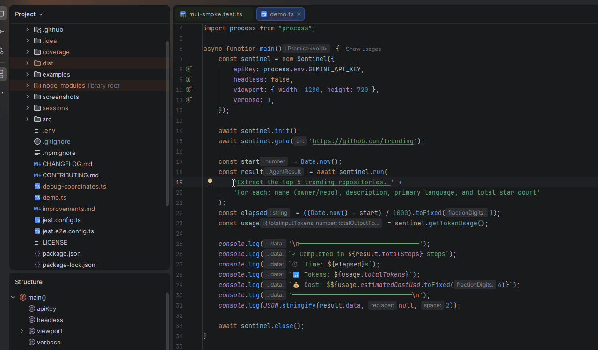
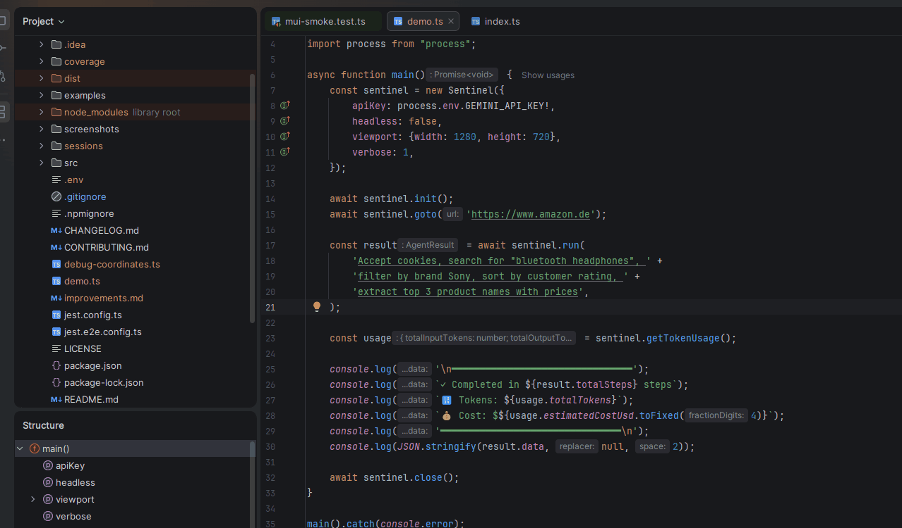

# @isoldex/sentinel

[](https://www.npmjs.com/package/@isoldex/sentinel)
[](https://www.npmjs.com/package/@isoldex/sentinel)
[](LICENSE)
[](https://isoldex.ai/docs)

**AI-powered browser automation for TypeScript.** Describe what you want in plain English, Sentinel figures out the selectors, clicks, and extracts data.



## Why Sentinel?

- **10× fewer LLM tokens** than Stagehand (2–5k per action vs 29–51k)
- **Self-healing selectors** — cached after first run, auto-regenerate on break
- **Multi-LLM support** — OpenAI, Claude, Gemini, Ollama
- **Built on Playwright** — drop-in for existing Node.js projects

## Install

```bash
npm install @isoldex/sentinel playwright
npx playwright install chromium
```

## Quick Start

```typescript
import { Sentinel } from '@isoldex/sentinel';

const sentinel = new Sentinel({ apiKey: process.env.GEMINI_API_KEY });
await sentinel.init();
await sentinel.goto('https://github.com/trending');

const result = await sentinel.run(
  'Extract the top 5 trending repositories with name, description, and star count'
);

console.log(result.data);
await sentinel.close();
```

## Real-world example: Amazon.de

A more complex multi-step task — search, filter by brand, sort by rating, extract structured data:



Running the same task with the same model (Gemini 3 Flash), Sentinel completed in **5 steps / under 20s / 23k tokens / $0.0019**. Stagehand timed out at 300s+ with one decision call alone consuming 210k tokens.

Full benchmark methodology and raw data: [isoldex.ai/benchmark](https://isoldex.ai/benchmark)

## Features

- **`act()`** — natural language actions (click, fill, select, scroll)
- **`extract()`** — structured data extraction with Zod schemas
- **`run()`** — autonomous multi-step agent with goal-driven planning
- **`fillForm()`** — declarative form filling with one JSON object
- **`intercept()`** — capture API responses instead of scraping DOM
- **MFA/TOTP** — auto-generate 2FA codes during login flows
- **CLI** — `npx sentinel run "goal" --url https://...`
- **MCP Server** — use Sentinel from Claude Desktop, Cursor, or any MCP client

## Documentation

- [Getting Started](https://isoldex.ai/docs)
- [API Reference](https://isoldex.ai/api-reference)
- [Examples](https://isoldex.ai/examples)
- [LLM Providers](https://isoldex.ai/providers) — OpenAI, Claude, Gemini, Ollama setup
- [MCP Server](https://isoldex.ai/mcp)
- [Benchmark vs Stagehand](https://isoldex.ai/benchmark)
- [Migrate from Stagehand](https://isoldex.ai/migrate)
- [Changelog](https://isoldex.ai/changelog)

## License

MIT
