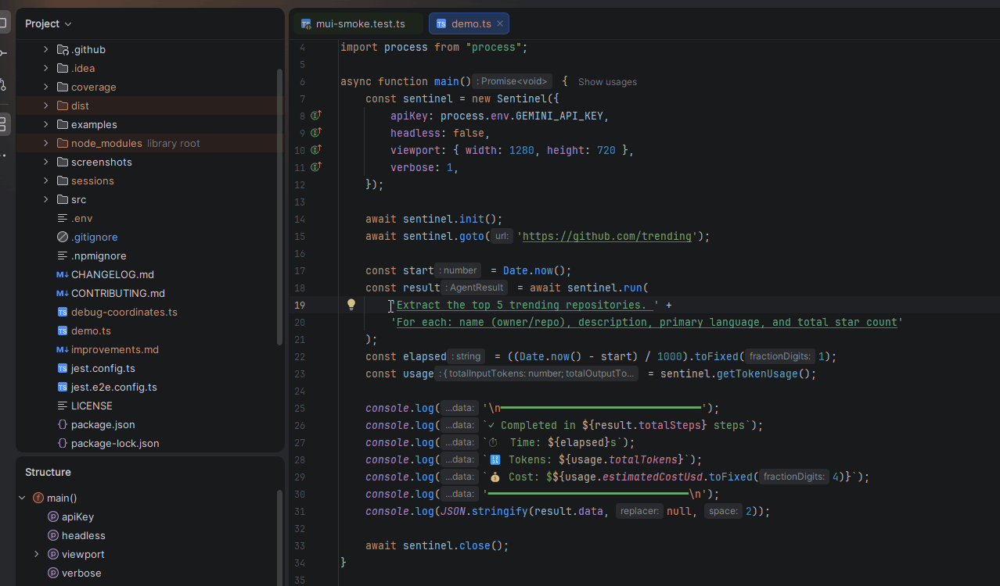
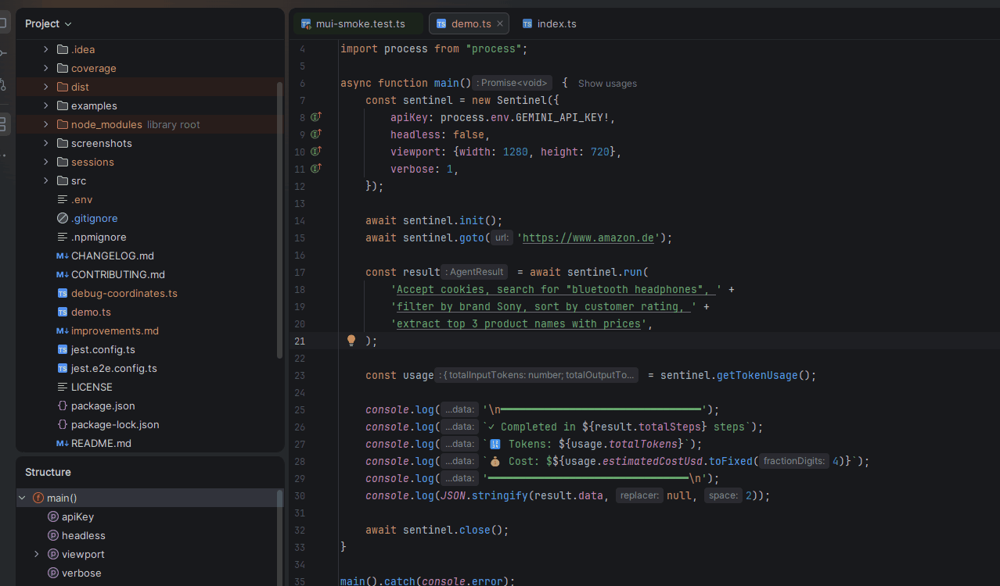

# @isoldex/sentinel

[](https://www.npmjs.com/package/@isoldex/sentinel)
[](https://www.npmjs.com/package/@isoldex/sentinel)
[](LICENSE)
[](https://isoldex.ai/docs)

**AI-powered browser automation for TypeScript.** Describe what you want in plain English, Sentinel figures out the selectors, clicks, and extracts data.



## Why Sentinel?

- **10× fewer LLM tokens** than Stagehand (2–5k per action vs 29–51k)
- **Self-healing selectors** — cached after first run, auto-regenerate on break
- **Multi-LLM support** — OpenAI, Claude, Gemini, Ollama
- **Built on Playwright** — drop-in for existing Node.js projects

## Install

```bash
npm install @isoldex/sentinel playwright
npx playwright install chromium
```

Gemini works out of the box. The other providers load their SDK on demand — install the one you use:

```bash
npm install @anthropic-ai/sdk   # ClaudeProvider
npm install openai              # OpenAIProvider
# OllamaProvider needs no package, just a running Ollama instance
```

Using the Playwright test fixture (`@isoldex/sentinel/test`) additionally requires `@playwright/test`.

## Quick Start

```typescript
import { Sentinel } from '@isoldex/sentinel';

const sentinel = new Sentinel({ apiKey: process.env.GEMINI_API_KEY! });
await sentinel.init();
await sentinel.goto('https://github.com/trending');

const result = await sentinel.run(
  'Extract the top 5 trending repositories with name, description, and star count'
);

console.log(result.data);
await sentinel.close();
```

## Real-world example: Amazon.de

A more complex multi-step task — search, filter by brand, sort by rating, extract structured data:



Running the same task with the same model (Gemini 3 Flash), Sentinel completed in **5 steps / under 20s / 23k tokens / $0.0019**. Stagehand timed out at 300s+ with one decision call alone consuming 210k tokens.

Full benchmark methodology and raw data: [isoldex.ai/benchmark](https://isoldex.ai/benchmark)

## Features

- **`act()`** — natural language actions (click, fill, select, scroll)
- **`extract()`** — structured data extraction with Zod schemas
- **`run()`** — autonomous multi-step agent with goal-driven planning
- **`fillForm()`** — declarative form filling with one JSON object
- **`intercept()`** — capture API responses instead of scraping DOM
- **MFA/TOTP** — auto-generate 2FA codes during login flows
- **CLI** — `npx sentinel run "goal" --url https://...`
- **MCP Server** — use Sentinel from Claude Desktop, Cursor, or any MCP client (stdio or standalone HTTP transport)

## Credentials

Either a Gemini `apiKey` or a custom `provider` — the type system enforces one of them, and providers carry their own credentials:

```typescript
new Sentinel({ apiKey: process.env.GEMINI_API_KEY! });
new Sentinel({
  provider: new OpenAIProvider({ apiKey: process.env.OPENAI_API_KEY!, model: 'gpt-4o' }),
});
new Sentinel({ provider: new OllamaProvider({ model: 'llama3.2' }) }); // no key at all
```

Use `variables` for anything secret. The placeholder is resolved for the browser but never for a cache, so a file-backed cache stores `%password%` rather than the value:

```typescript
await sentinel.act('Fill %password% into the password field', {
  variables: { password: process.env.APP_PASSWORD! },
});
```

## Cancelling a run

`runStream()` stops the agent as soon as you stop consuming it — a `break`, an exception, or an SSE client disconnecting. Pass `signal` to cancel from elsewhere (e.g. `request.signal`):

```typescript
for await (const event of sentinel.runStream(goal, { signal })) {
  if (isEnough(event)) break; // agent halts; no further tokens are spent
}
```

## MCP server over HTTP

Defaults to `127.0.0.1:3333` with no authentication, which is safe only because it is loopback-only: requests are rejected unless `Host` and any `Origin` are loopback. Exposing it further requires a token, and the server refuses to start without one.

| Variable                                  | Default              | Purpose                                              |
| ----------------------------------------- | -------------------- | ---------------------------------------------------- |
| `SENTINEL_MCP_HTTP`                       | –                    | Set to `1` for HTTP instead of stdio                 |
| `SENTINEL_MCP_HOST` / `SENTINEL_MCP_PORT` | `127.0.0.1` / `3333` | Bind address                                         |
| `SENTINEL_MCP_TOKEN`                      | –                    | Bearer token. **Required** for a non-loopback host   |
| `SENTINEL_MCP_ALLOWED_HOSTS` / `_ORIGINS` | –                    | Comma-separated additions to the loopback allow-list |
| `SENTINEL_MCP_MAX_BODY_BYTES`             | `4194304`            | Request body cap                                     |

All requests share one browser session, so tool calls are serialised. HTTP mode decouples the client from the process; it is not a way to serve concurrent users.

## Documentation

- [Getting Started](https://isoldex.ai/docs)
- [API Reference](https://isoldex.ai/api-reference)
- [Examples](https://isoldex.ai/examples)
- [LLM Providers](https://isoldex.ai/providers) — OpenAI, Claude, Gemini, Ollama setup
- [MCP Server](https://isoldex.ai/mcp)
- [Benchmark vs Stagehand](https://isoldex.ai/benchmark)
- [Migrate from Stagehand](https://isoldex.ai/migrate)
- [Changelog](https://isoldex.ai/changelog)

## License

MIT
